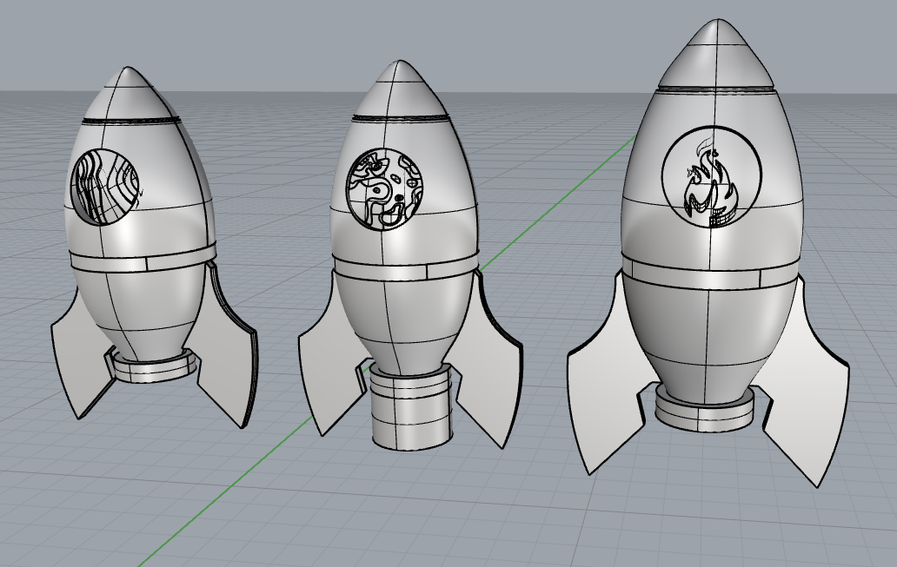

# Coognitive Orgies II - Peace Missile 
{ align=left }

What if the same systems that deliver warheads can deliver lifelines. The proeject was based on the idea of an Aid Cannon — reframed as a Peace Missile. It senses climate catastrophes and fires relevant aid drops to those in need. The visual language was deliberate: a bundle of aid missiles launching parachuted supply packages. Something that looks like a weapon but delivers care. The name itself carries the statement. 

## Personal reflection:
This project of the ‘peace missile’ started off with our excitement in the project and passion. Somehow in this world of chaos and war around us having something made for violence used for aid just felt right. 

## Moral Traces:
Since the idea behind this project was empathy based- bringing that empathy to a tangible result was the challenge. More than that however I think we struggled a bit with over-complicating it. Building the system to read and interpret natural disasters was one part- but then making the system that released the correct aid as per the data interpreted is where we struggled a bit. 
We started off with trying to have one ‘peace missile’ connected to 3 different belts that released the right package into it as per the read trigger. We struggled with getting those release mechanisms for a while until we realized these systems do exist in oa ce already we don't need to int=fnet the same for a prototype we just need to show how that read data is implemented. One we realized that building the prototype was easier to deal with. 

## Technical Process Traces:
The Technical process here was a bit smoother because of Miguel's help and knowledge of n8n- which helped make an easier chain and AI response system to natural disasters around the world. But connecting that technical output to the mechanical output of the prototype is where we struggled a bit and had to make multiple trials to finally achieve. 

