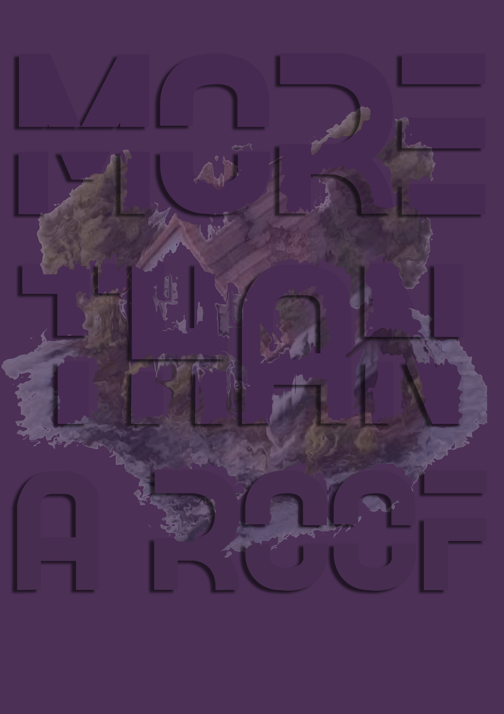
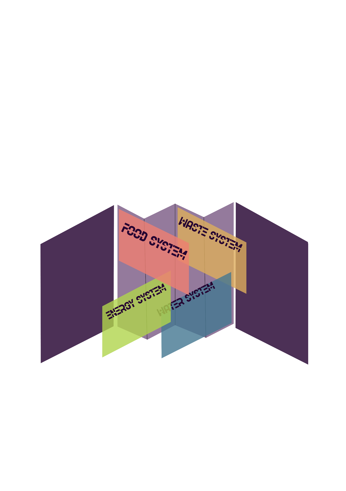

# Narratives - Publication

#Snapshot - Armin 
{ align=left }
Based on the speed questionnaire and a detailed discussion with Armin, I created this collage-style pictograph to represent his project. The work explores an analytical study of people’s reliance on AI to complete tasks, examining the moral and sociological implications this dependence has on individuals as well as on the broader functioning of society. It further investigates the growing use of AI in professional settings, particularly how this increasing reliance may gradually limit or reshape creative thinking.

#Individual Publication
{ align=left }
{ align=right }

For my final project which dwels into a research into the possibilities of emergency shelters that aren’t simply a roof over our heads but are self-sustainable modules with an independent infrastructure of its own. The module will not only recycle and reuse water and waste, but also produce food with living biomaterial walls. As the research looks at four facros of self-reliance in terms of food, water, waste and energy - I've made a flag-type of book where the four differen systems are shown in smaller folable oages, with the final integrated system and design in the background. 
