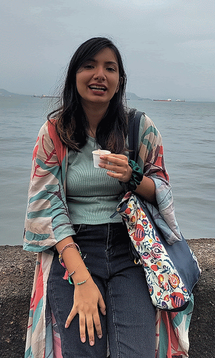

{ align=left }

There’s a quiet beauty in recognising that every place, object, and person carries a unique story. As an architect, I don’t just witness these stories—I help shape the spaces they unfold in. Come follow me in my journey in IAAC as I explore design with different possibilities in my Masters in Design for Emergent Futures. 

With this Masters, I aim to channel that understanding into designing not simply to provide shelter, but to do so with dignity, care, and justice. I’m endlessly fascinated by how people move through spaces — how light, material, and emotion shape our sense of home, safety, and wonder. That curiosity has led me beyond blueprints and renderings, into storytelling, research, and design thinking. Here you’ll see how I get to articulate that research and thinking. 

