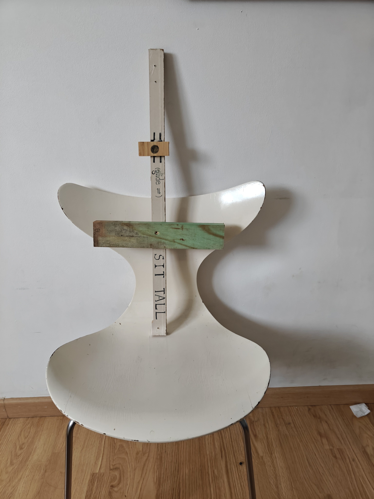
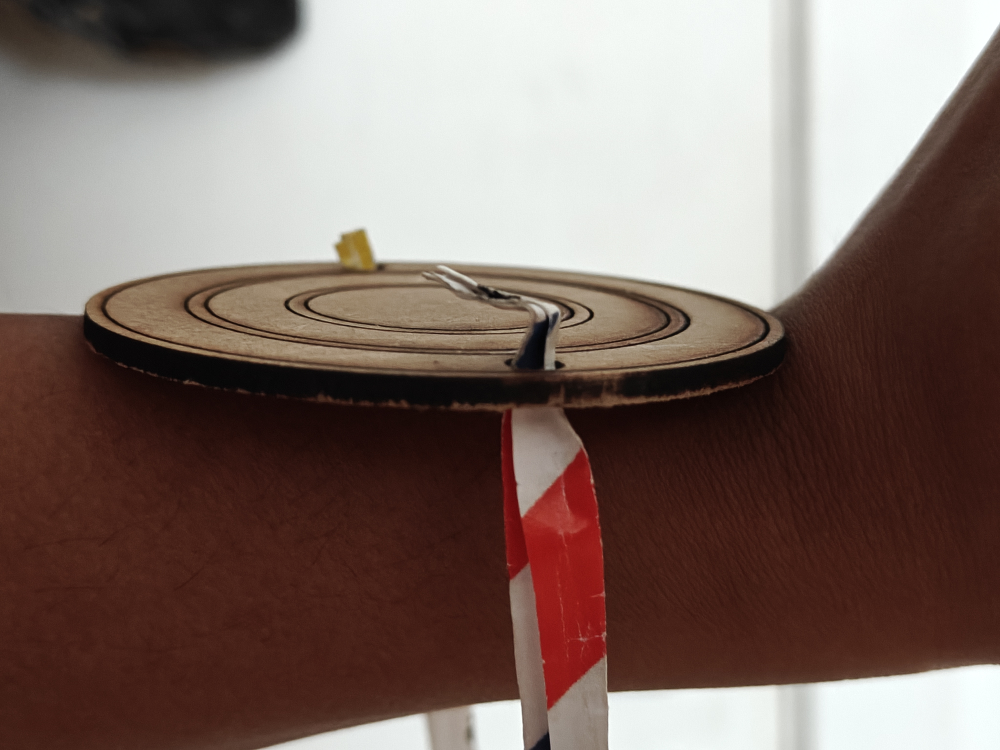
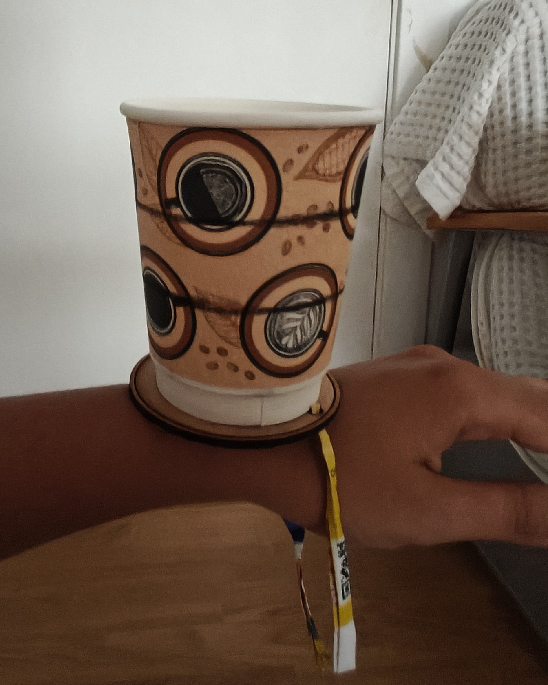
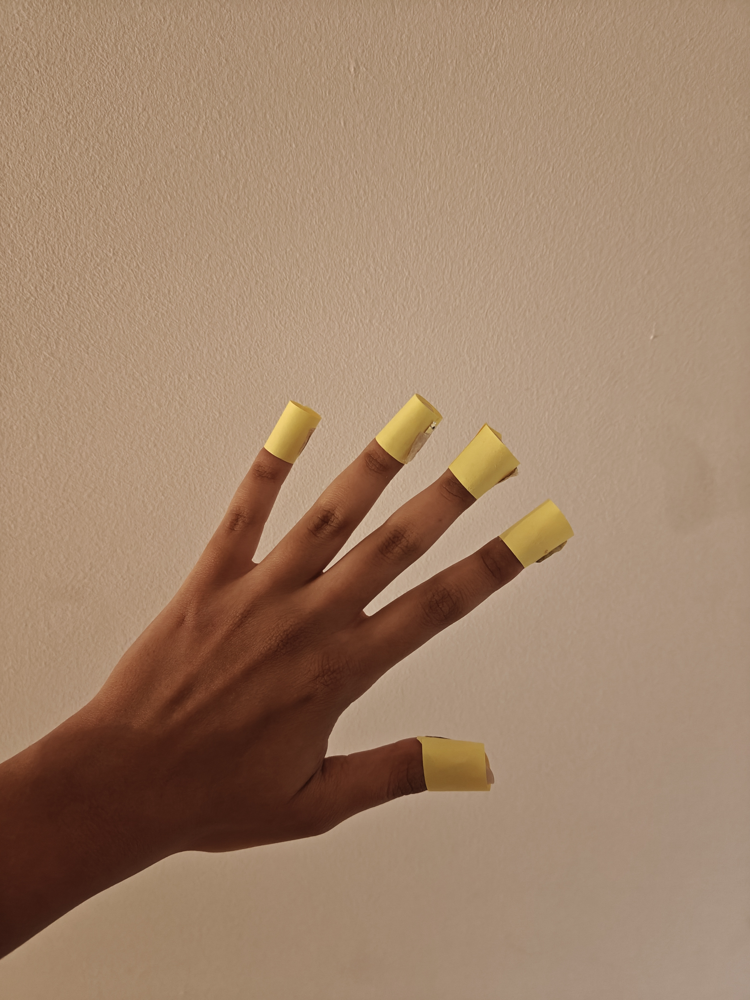
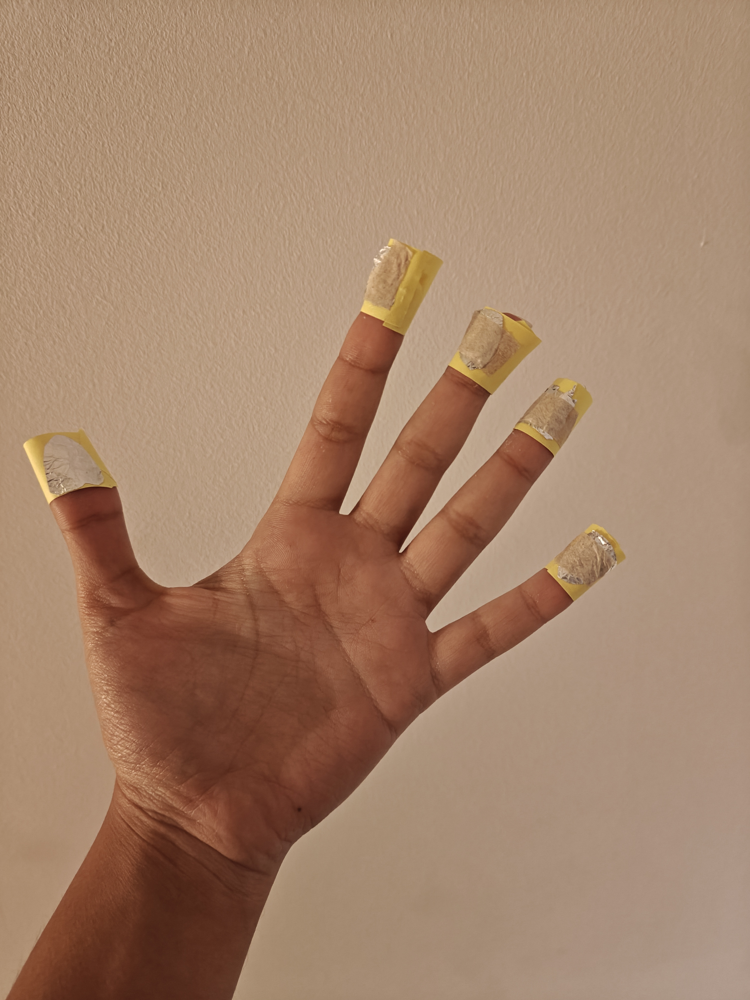
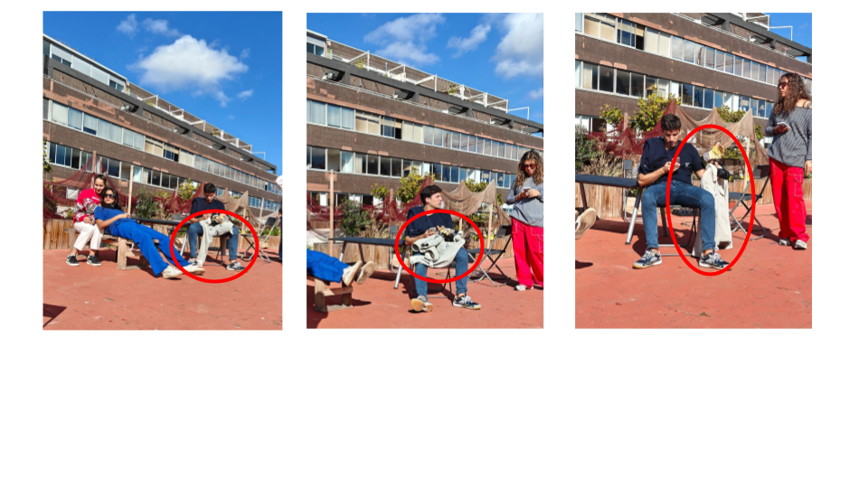
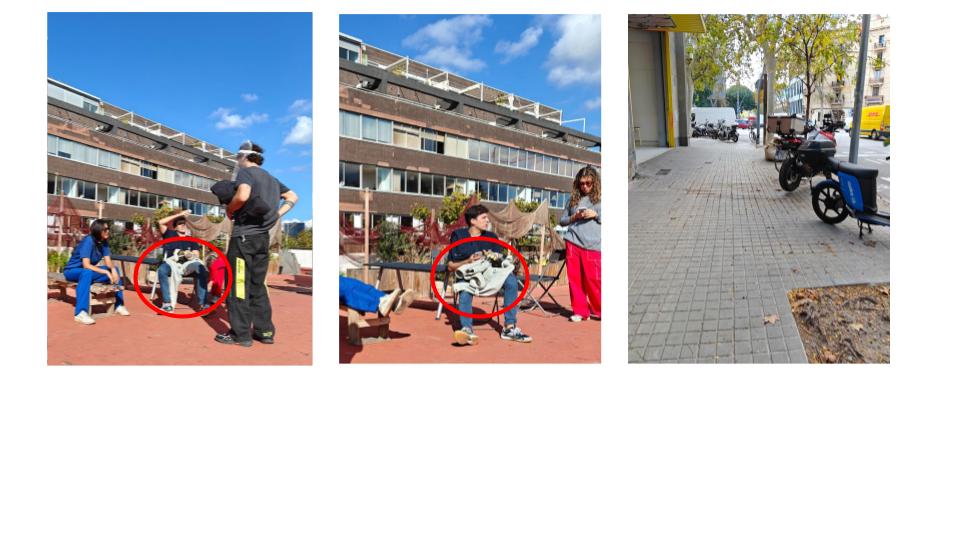
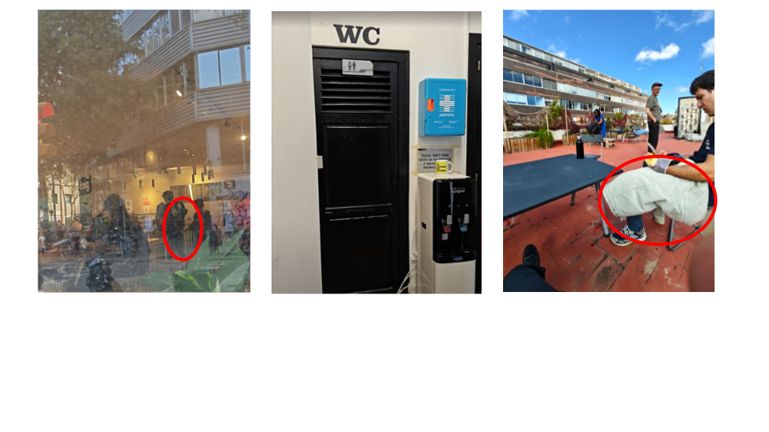
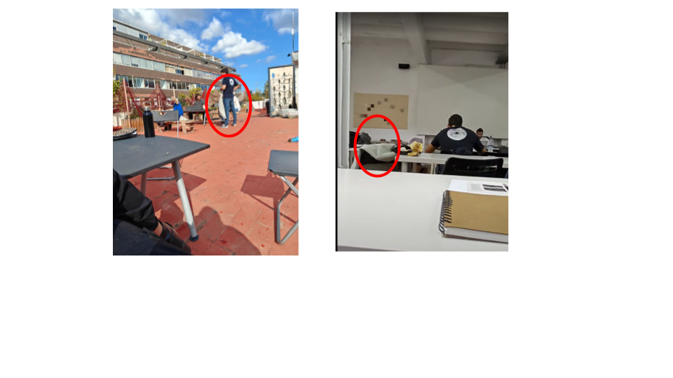

# Living With Your Own Ideas
##<h2>Prototype 1 - Sit Tall </h2>
{ align=left }
{ align=centre }
{ align=right }

  
  
  

Generationally, we are living in an era of sitting. We wake up, get into a car or train, and sit; then we go to college or the office, where we sit some more; and after a long day, we return home only to sit on the couch again. It’s no surprise that poor posture and back problems are becoming common from a young age. So in an attempt to counter and avoid that bad posture I designed a prosthesis which will help me sit straight wherever.

I designed Sit Tall, a prosthetic support system that helps me maintain an upright posture wherever I sit. Sit Tall works on simple principles of physics and magnetic fields. It consists of two main components. The first is a cross-like structure that rests against the back of a chair. Its horizontal member supports my shoulders, while the lower end features a small copper disc that can be adjusted vertically to match my height.

The second part is a belt fitted with an adjustable magnet. I position the belt so that the magnet sits in the concave area of my lower back. When I sit, the magnet faces the copper disc on the chair, creating opposing magnetic fields. This repelling force makes it physically difficult for my back to slouch, naturally encouraging me to sit upright.
What I like about Sit Tall is that it doesn’t just remind me to sit straight — it actually helps me in doing so. It’s a simple, physics-driven intervention that transforms posture correction from a conscious effort into an effortless physical response.

<iframe width="560" height="315"
  src="https://www.youtube-nocookie.com/embed/_ZRXZwHoY0g"
  title="YouTube video player"
  frameborder="0"
  allow="accelerometer; autoplay; clipboard-write; encrypted-media; gyroscope; picture-in-picture; web-share"
  allowfullscreen>
</iframe>

##<h2>Prototype 2 - PHold </h2>

{ align=left }
{ align=centre }
{ align=right }

These days, everything is designed to be portable — my umbrella folds small enough to fit in a coat pocket, and my headphones collapse to fit into even my smallest purse. So I started wondering: why can’t my drinking glass do the same?

As women, we often move through the world on alert. In crowded or chaotic places, that sense of caution heightens — and one of my biggest fears has always been the possibility of someone spiking my drink.
That concern led me to design my own solution: a foldable silicon glass that disguises itself as a bracelet. It not only compresses into a compact, wearable accessory but also incorporates pH indicators that change the color of the drink if any suspicious substance is added.

With this design, I’ve created something that helps me feel safer and more at ease — a small innovation that reduces my reliance on society’s safeguards and gives me control over my own sense of security.

<iframe width="560" height="315"
  src="https://www.youtube.com/embed/sXQx7FnkAPI"
  title="YouTube video player"
  frameborder="0"
  allow="accelerometer; autoplay; clipboard-write; encrypted-media; gyroscope; picture-in-picture"
  allowfullscreen>
</iframe>

##<h2>Prototype 3 - Frog Fingers </h2>

{ align=left }
{ align=centre }

In this exercise, where we were asked to design a prosthesis based on what we aspire to become, I chose to embody a frog! Frogs are truly fascinating creatures — being among the few species capable of breathing both underwater and on land with remarkable ease. Their textured, suction-like toes provide them with exceptional grip, enabling agile movement across a wide range of surfaces.

Inspired by this adaptability, I designed frog fingers — a prosthetic extension that replicates the tactile and adhesive qualities of a frog’s skin. The prototype was made using layers of paper, aluminium foil, and wet tissue, materials that together mimic the combination of structure, flexibility, and moisture necessary for suction. The foil provided form and resilience, the paper added texture and support, and the damp tissue created a temporary seal when pressed against smooth surfaces, generating mild suction through air displacement.

<iframe width="560" height="315"
  src="https://www.youtube.com/embed/LORP80k4m8A"
  title="YouTube video player"
  frameborder="0"
  allow="accelerometer; autoplay; clipboard-write; encrypted-media; gyroscope; picture-in-picture"
  allowfullscreen>
</iframe>

##<h2>Prototype 4 - Stress Sleeves </h2>

In line with the theme of frogs, one of the most fascinating characteristics of the wood frog is its remarkable ability to become, quite literally, a <b>living icicle</b>. During winter, the wood frog burrows beneath leaves and allows its body to freeze completely—its heart stops, and brain activity comes to a halt. Meanwhile, the frog’s liver produces a surge of glucose that floods every cell in its body. This syrup-like sugar solution prevents the cells from freezing and binds to water molecules, protecting the cells from dehydration.

In essence, the wood frog’s body permits ice to form around its cells and organs, while simultaneously preventing ice crystals from forming within the cells—thus avoiding the fatal cellular damage that freezing would cause in most animals.

Drawing inspiration from this extraordinary adaptation, I wanted to explore whether it’s possible to design a material—or a kind of “stress”—that behaves similarly: one where the outer layer resists external stress or cold, while the inner layer remains warm and gentle against the body.

##<h2>Surveillance Tapes </h2>

{ align=left }
{ align=left }
{ align=left }
{ align=left }

##<h2>Tiny Pockets Of Stories For My Surveiler </h2>

When chanced with the idea that I get to curate the experience of what my detective see's in me. I thought a lot about and decided I'll make it a game for myself - I'd challenge them to understand what I'm trying to do or show, rather than allowing them to be the ones in control. So I got red stickers and walked around aimlessly with the idea of putting the same kind of stickers for similar patterns, two for a grocery store, one for a cafe we got to regularly after class and so on. But as with life nothing goes as per your plan especially when you're adding another player into the game. So I lost my detective quite early in the game. Now the idea of this game seemed obsolete if they don't even know where to look. So I upped the game again. I sent my location in a group of my possible stalkers and then went around with the same idea of stickers but stickers as markers of how to find me. Slowly realizing I was once again doing things for them rather then for me, I started having fun with it - I left the clues but always in this tiny spots of whimsy. A street light with a funny poster, a window with a pretty reflection. 

Its interesting how only when it was for someone else to see we curate and look for these tiny moments of joy, but when its just us we ignore them considering ourselves not worth our own effort? Maybe in trying to be seen, I accidentally learned how to look.

##<h2>Reflections </h2>

It’s in human nature to evolve with time. Yet, the more we come to understand evolution — its slowness, its quiet patience — the more restless we seem to grow with our own biology. We’ve become impatient with nature’s gradual unfolding, unwilling to wait for our bodies to adapt to the demands of our imagination. So we create prosthetics, extensions, and technologies — not merely to repair or replace, but to accelerate what evolution cannot yet deliver.

This workshop, bringing together such a diverse constellation of people and ideas, made me reflect on that impatience — but also on the beauty of it. Each speaker shared how their work with prosthetics and design isn’t just about improving “efficiency,” but about expanding human experience itself. It’s not only a technical pursuit, but a philosophical one — an experiment in perception.

Take Manel, the cyborg artist, who decided that temperature and air pressure need not be confined to touch or smell, but could be translated into sound — transforming the invisible forces around us into something we could hear. Or Thomas Thwaites, who chose to step outside human perception altogether, living as a goat for a week to experience the world from an entirely different sensory logic.

These examples revealed something profound to me: that by changing the way we experience the world, we inevitably change the way we interpret it. And when our perceptions shift, so too do our judgments — of people, of animals, of nature itself. Perhaps, then, evolution is not only biological, but perceptual — and the tools we build are not just extensions of the body, but instruments for expanding the boundaries of what it means to be human.

