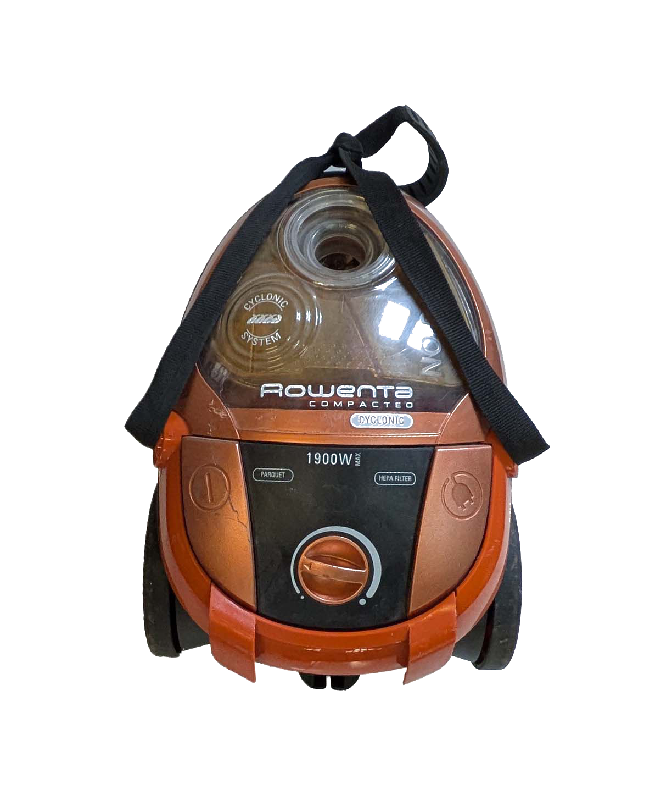
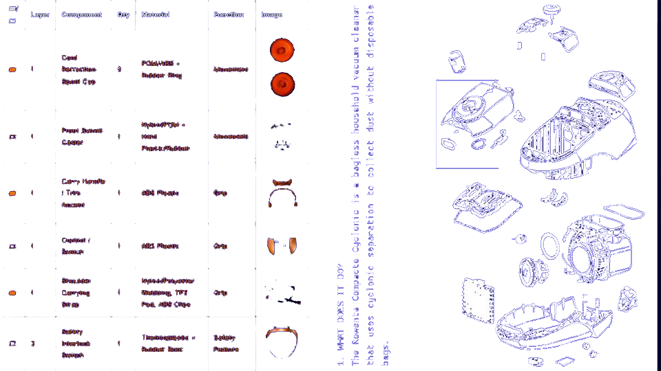
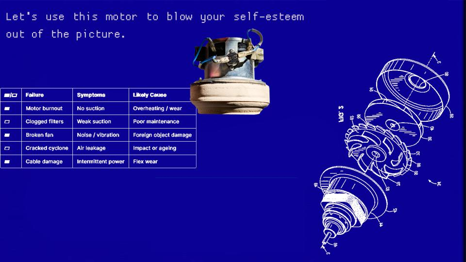
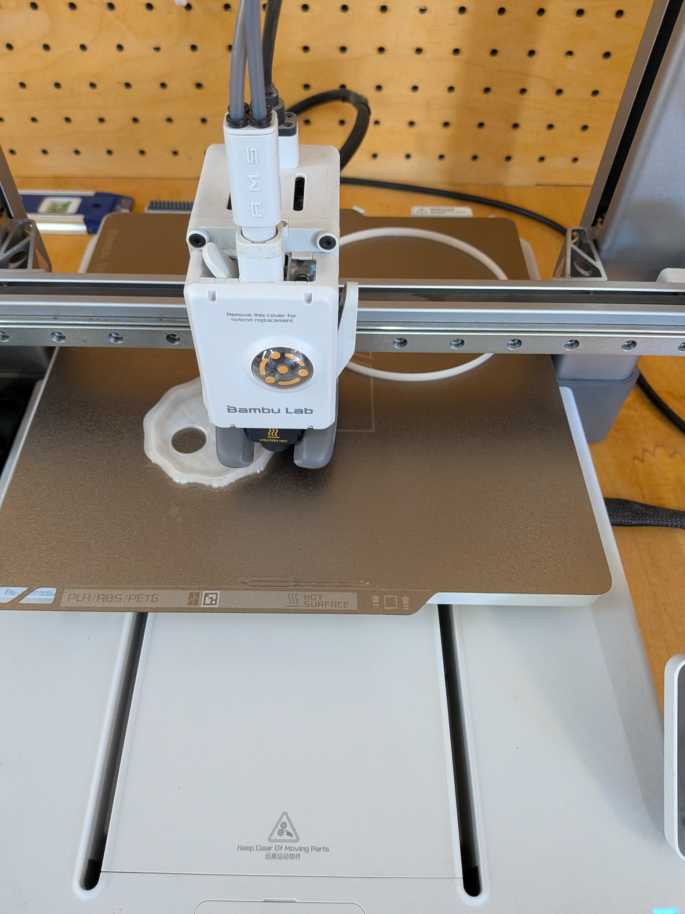
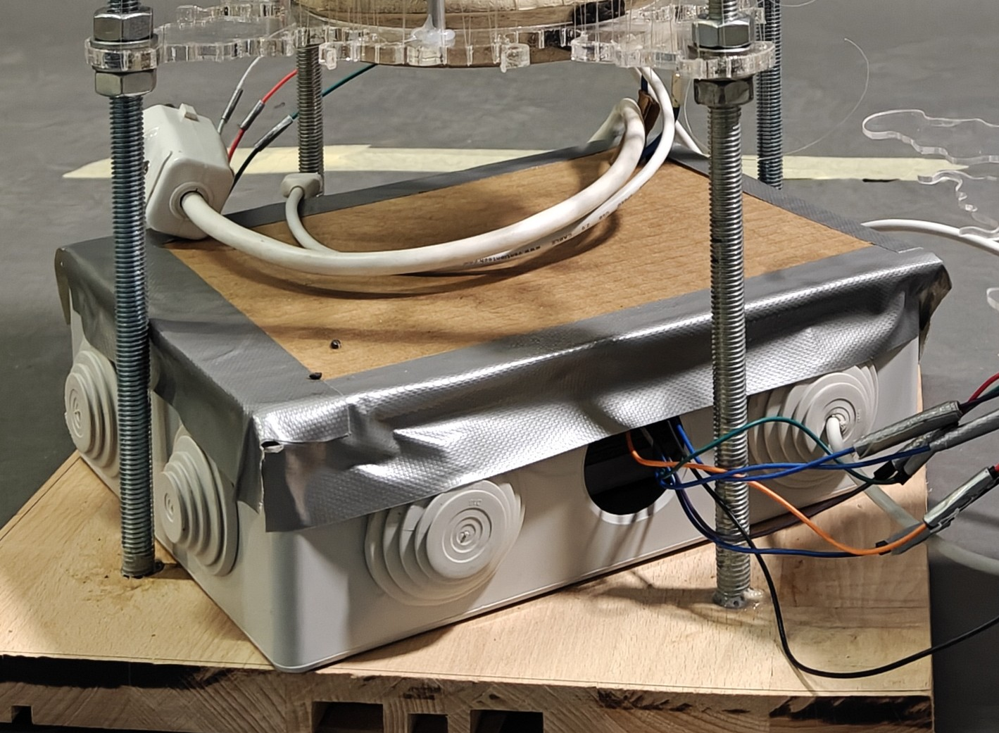

# Unpacking Technology
##<h2>Taking It Apart</h2> 
###<h3>Case identifier:</h3> Forensics of the Obsolescence 
<b>Date of report:</b> 20/11/2025 
<b>Subject of the reporting agency:</b> Vacuum cleaner

{ align=left }

Before going toward the junkyard of possibilities we decided to keep some parameters for ourselves while choosing the machinery we wanted to study, explore, and later transfer. A lot of modern technology is mostly electric and code based with a shell encasing the same. Having a mix of mechanical and electric played a large factor is choosing this as the subject for the workshop.

<h2>Next Step : Taking it Apart </h2>
About the machine: 
<b>Brand:</b> Rowenta Compact Cyclonic Vacuum Cleaner
<b>Model: VC21VW0
<b>Serial number:</b> R0346301 / RO346301
<b>Colour:</b> ORANGE (plastic), BLACK (plastic), BLACK (resin)
<b>Made in:</b> Germany, Romania, Spain, China, France, International

<iframe width="560" height="315"
  src="https://www.youtube.com/embed/gjFevNFWh2Q"
  title="YouTube video player"
  frameborder="0"
  allow="accelerometer; autoplay; clipboard-write; encrypted-media; gyroscope; picture-in-picture; web-share"
  allowfullscreen>
</iframe>

{ align=left }
{ align=right }

##<h2>What does it do?</h2>
The Rowenta Compacte Cyclonic (RO346301) is a bagless canister vacuum cleaner designed for domestic dry cleaning. It utilizes high-power suction (up to 1900W) to remove dust, debris, and pet hair from various floor surfaces (hardwood, tile, carpet). Unlike traditional vacuums that rely on bags to trap dirt, this device separates dust from the air stream and stores it in a reusable bin.
How does it work?

The device operates on the principle of cyclonic separation:
<b>Suction Generation:</b> A high-speed universal electric motor creates a pressure drop, drawing air in through the nozzle and hose.

<b>Cyclonic Action:</b> The air enters the dust container tangentially, creating a high-velocity spinning vortex (cyclone). Centrifugal force flings heavier dust and debris outward against the bin walls, where it falls to the bottom.

<b>Filtration:</b> The partially cleaned air passes through a series of filters (foam and HEPA) to trap fine microscopic particles that escaped the cyclone.
Exhaust: Clean air is exhausted out the back of the unit, often passing over the motor to cool it.

##<h2>How it’s built?</h2>
The vacuum is constructed primarily of injection-molded plastics.
Chassis: Made of durable ABS plastic to withstand impact and heat. It houses the motor bucket, cord reel, and control electronics.

<b>Motor:</b> A universal AC series motor is used for its high power-to-weight ratio. It is mounted in sound-dampening foam to reduce noise.

<b>Airpath:</b> The airways are sealed with rubber gaskets to maintain pressure. The hose is flexible PVC reinforced with a spiral wire or plastic ridge.

<b>Bin:</b> The dust container is transparent polycarbonate, allowing the user to see when it is full.

<iframe width="560" height="315"
  src="https://www.youtube.com/watch?v=bFKvsB9ai_c"
  title="YouTube video player"
  frameborder="0"
  allow="accelerometer; autoplay; clipboard-write; encrypted-media; gyroscope; picture-in-picture; web-share"
  allowfullscreen>
</iframe>

##<h2>Why did it fail, or it wasn't used anymore?</h2>
Hypothesis based on common faults for this model: The device likely failed due to motor burnout caused by airflow restriction.

<b>Root Cause:</b> Users often neglect to clean the foam/HEPA filters in bagless vacuums. As the filters clog with fine dust, airflow to the motor is restricted.

<b>Mechanism of Failure:</b> The motor relies on incoming airflow for cooling. With blocked filters, the motor overheats. Eventually, the thermal fuse trips, or the copper windings melt/short-circuit. Alternatively, the carbon brushes in the motor may have worn down completely after years of use, breaking the electrical circuit.

##<h2> Weeek 2 - The Evolution </h2> 

<b>Primary Inspiration  – Vacuum Motor </b>
According to physics, the air a vacuum pulls in must also be released—energy can neither be created nor destroyed. So instead of using the suction side of the vacuum motor in our new device, what if we utilize the opposite side, the one that blows air out?” 
{ align=left }

<b> Presenting "THE GOBLET OF MISFORTUNE"
{ align=left }

Parts Composing it:
1. Motor blowing
{ align=left }

2. Sensing dome, with motion sensors connected to Vacuum potentiometer (used to increase and decrease intensity of voltage output)
{ align=left }
{ align=right }

3.Arduino with connections to led lights, motor and motion sensors

<iframe width="560" height="315"
  src="https://youtube.com/shorts/4I2kd1cIoJg?feature=share"
  title="YouTube video player"
  frameborder="0"
  allow="accelerometer; autoplay; clipboard-write; encrypted-media; gyroscope; picture-in-picture; web-share"
  allowfullscreen>
</iframe>

<iframe width="560" height="315"
  src="https://youtube.com/shorts/kYBtxWwSe8M?feature=share"
  title="YouTube video player"
  frameborder="0"
  allow="accelerometer; autoplay; clipboard-write; encrypted-media; gyroscope; picture-in-picture; web-share"
  allowfullscreen>
</iframe>

Challenges are the key to innovation. For example here our aim was to effectively use a motion sensor as a 'virtual' potentiometer to regulate power intensity. The challenge was enabling this adjustment without direct manual rotation of the potentiometer itself. To overcome this, we designed and 3D-printed a custom housing for the potentiometer. This setup allows a rotating servo motor to precisely turn the potentiometer, with its movement directly corresponding to the user's distance and thus adjusting the power output.

{ align=left }

4.Electric box (safety purposes)
{ align=left }

5.Airflow-concentrating funnel 
The vacuum cleaner’s motor had multiple outlet points, so to focus the airflow we 3D-printed a funnel. This funnel acted both as a focal nozzle and as a protective housing for the motor.
7.Structural support frame for the motor and associated components
{ align=left }
{ align=left }

##<H2>And Together we have </H2>
{ align=left }
<iframe width="560" height="315"
  src="https://youtu.be/HSaH7ao7ed8"
  title="YouTube video player"
  frameborder="0"
  allow="accelerometer; autoplay; clipboard-write; encrypted-media; gyroscope; picture-in-picture; web-share"
  allowfullscreen>
</iframe>

<iframe width="560" height="315"
  src="https://drive.google.com/file/d/1vnWLOiYOPbjOlvPVa9FJGPLCTp8tL2Uv/view?resourcekey"
  title="YouTube video player"
  frameborder="0"
  allow="accelerometer; autoplay; clipboard-write; encrypted-media; gyroscope; picture-in-picture; web-share"
  allowfullscreen>
</iframe>

Zine:
{ align=left }

